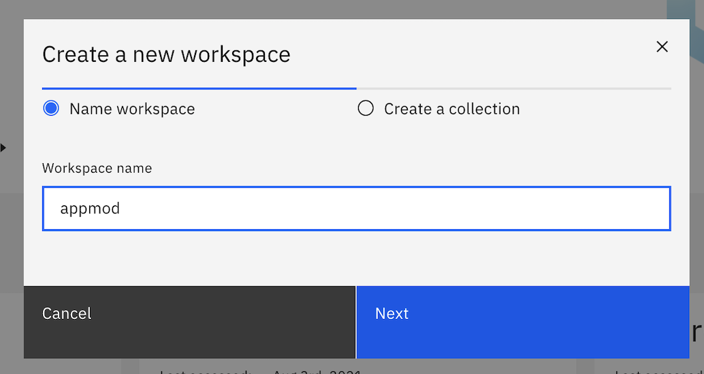
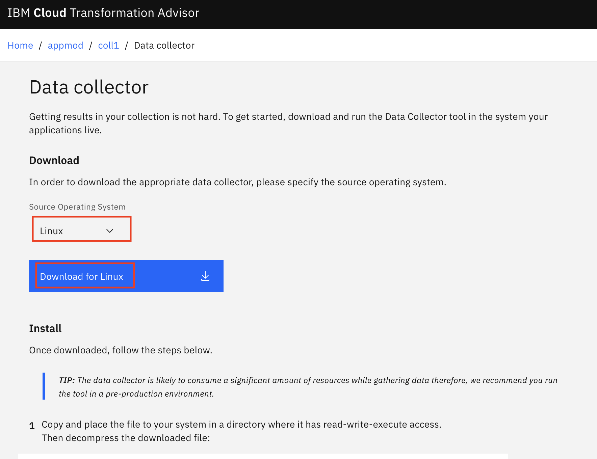

# Transform your traditional on-premises app and deploy it as a containerized app on a public cloud
**Modernize Apps using IBM Transformation Advisor on IBM Cloud Pak for Applications on the IBM managed OpenShift cluster**

In this code pattern, we will use Transformation Advisor on IBM Cloud Pak for Applications to evaluate an on-premises traditional WebSphere application. We'll use Transformation Advisor, download the generated migration bundle and use its recommendations to deploy that app in a Liberty container running on IBM Cloud Pak for Applications running on the IBM managed OpenShift. 

A sample web app is provided to demonstrate migration from on-premises to the IBM Cloud Pak for Applications.

When the reader has completed this code pattern, they will understand how to:

* Access IBM Cloud Pak for Applications on the IBM managed OpenShift cluster (ICP4A)
* Use Transformation Advisor to create a custom Data Collector
* Run the custom Data Collector to analyze a traditional WebSphere app
* Review the Transformation Advisor reports to see migration complexity, cost, and recommendations
* Generate artifacts to containerize the app
* Move the modernized app to IBM Cloud Pak for Applications on IBM managed OpenShift Cluster using a generated migration bundle

## Flow


1. Developer accesses IBM Transformation Advisor on IBM Cloud Pak for Applications on the IBM managed OpenShift cluster.
2. Developer downloads a custom Data Collector from IBM Transformation Advisor
3. Developer runs the Data Collector on the traditional WebSphere Application Server host where application(to be migrated) is running
4. Data Collector analysis is uploaded (automatically or manually)
5. Developer reviews recommendations in Transformation Advisor and creates a migration bundle
6. Developer downloads migration bundle
7. Developer uses Docker to build an image and upload it to OpenShift Docker Registry
8. Developer creates an app using the pushed image and runs the containerized app


## Pre-requisites

* [IBM Cloud account](https://cloud.ibm.com/) 
* [IBM managed OpenShift Cluster instance](https://cloud.ibm.com/kubernetes/catalog/create?platformType=openshift&bss_account=46816354d9cb773bae86c226aa74c8cc&ims_account=2001776)
* [OpenShift CLI](https://cloud.ibm.com/docs/openshift?topic=openshift-openshift-cli)
* [Docker](https://www.docker.com/)

## Steps

1. [Install IBM Cloud Pak for Applications](#1-install-ibm-cloud-pak-for-applications)
2. [Get started with the Transformation Advisor](#2-get-started-with-the-transformation-advisor)
3. [Download and run the Data Collector](#3-download-and-run-the-data-collector)
4. [Upload results, if necessary](#4-upload-results-if-necessary)
5. [View the recommendations and cost estimates](#5-view-the-recommendations-and-cost-estimates)
6. [Complete your migration bundle](#6-complete-your-migration-bundle)
7. [Deploy your application on ICP4A](#7-deploy-your-application-on-icp4a)

## 1. Install IBM Cloud Pak for Applications

Please refer to this [video](https://www.youtube.com/watch?v=gBI0ApHUFSs) to install IBM Cloud Pak for Applications on the IBM managed OpenShift cluster. 

If in case you are not working on IBM managed OpenShift cluster, then refer this [link](https://www.ibm.com/support/knowledgecenter/SSCSJL_4.1.x/install-icpa-cli.html) to install IBM Cloud Pak for Applications.

## 2. Get started with the Transformation Advisor

As part of IBM Cloud Pak for Applications, Transformation Advisor is a tool that helps businesses modernize and migrate their applications from on-premises environments to the cloud. Please refer [docs](https://www.ibm.com/support/knowledgecenter/SS5Q6W/welcome.html) to learn more about Transformation Advisor. The following instructions will help you to get started with the Transformation Advisor:

* Open `OpenShift Web Console` and then click on `Cloud Pak Console`.
 
 
* Open `Transformation Advisor`
  

* On the welcome screen, click the `+` to add a workspace.

  

* Create a new workspace that will be used to house your recommendations. The workspace name can be any string you want, such as the project name or the name for the portfolio of applications you will be analysing -- basically anything that will help you to easily identify your work when you return to it at a later date.

  

* You will then be asked to enter a collection name. This is an opportunity for you to subdivide your work even further into a more focused grouping. It would typically be associated with a single run of the Data Collector and may be the name of the individual WAS server that you will be running the Data Collector on. It can be any string and can be deleted later -– so don’t be afraid to get creative!

  

* Hit `Let’s Go`.

## 3. Download and run the Data Collector

> If you don't want to run our sample app and the Data Collector in your own WAS environment, you can use the files that we already collected and saved in [data/examples](data/examples). Just upload them in [the next step](#4-upload-results-if-necessary) to continue.

The Data Collector identifies which profiles are associated with the WebSphere installation along with the installed WebSphere and Java versions. It also identifies all WebSphere applications within each deployment manager and standalone profile. The tool generates one folder per profile and places analysis results within that directory.

> Note: The Data Collector will collect configuration information in WAS installations at version 7 or later.

### Download the Data Collector

You would see the screen shown below. The Data Collector is a downloadable zip file that needs to be extracted and run on your target server where the applications you wish to migrate are located (i.e., your WAS application server machine).

* Click on `Data Collector`.

  
 
* You should choose the correct Data Collector for your target server’s operating system and then Download.

### Install and run

> **WARNING:** The Data Collector is likely to consume a significant amount of resources while gathering data. Therefore, we recommend you run the tool in a pre-production environment. Depending on the number, size and complexity of your applications the Data Collector may take quite some time to execute and upload results.

Once downloaded, follow these steps:

* Copy/FTP from your download directory to your target server. Put the zip file in a directory where you have read-write-execute access.

* Decompress the downloaded file. Your file name will be specific to your platform/version/collection.
  ```
  tar xvfz transformationadvisor-2.1_Linux_example.tgz
  ```

* Go to the Data Collector directory.
  ```
  cd transformationadvisor-2.1
  ```
* Perform analysis of app, .ear and .war files on IBM WebSphere applications.
  ```
  ./bin/transformationadvisor -w <WEBSPHERE_HOME_DIR> -p <PROFILE_NAME> <WSADMIN_USER> <WSADMIN_PASSWORD> -no-version-check
  ```

## 4. Upload results, if necessary

If there is a connection between your system and your new collection, the Data Collector will send your application data for you. You can see the results and continue with the following section:
[View the recommendations and cost estimates](#5-view-the-recommendations-and-cost-estimates).

If there is no connection, the Data Collector will return a .zip file containing your application data. Use the `Upload data` option to upload the .zip file(s).

* Find the results for each profile. These are zip file(s) created by the Data Collector with the same name as the profile. You will find the zip file(s) in the transformationadvisor directory of the Data Collector.

* Copy the zip file(s) to your local system and select them using the `Drop or Add File` button.

* Use the `Upload` button to upload the files.

## 5. View the recommendations and cost estimates

Once the Data Collector has completed and uploaded results, it should display a screen similar to that shown below. Please be aware that any cost estimates displayed by the tool are high-level estimates only and may vary widely based on skills and other factors not considered by the tool.

> Note: You can use the `Advanced Settings` gear icon to change the `Dev cost multiplier` and `Overhead cost` and adjust the estimates for your team.


The recommendations tab shows you a table with a summary row for each application found on your application server. Each row contains the following information:

| Column | Description |
| ------ | ----------- |
| | *A drop-down arrow lets you expand the summary row to see the analysis for other targets.* |
| | *Alert icons may appear to indicate apps that are incompatible with a target.* |
| Application | *The name of the EAR/WAR file found on the application server.* |
| | *An indicator to show how complex Transformation Advisor considers this application to be if you were to migrate it to the cloud.* |
| Tech match | *This is a percentage and if less than 100% it indicates that there may be some technologies that are not suitable for the recommended platform. You should investigate the details and ensure your application is actually using the technologies.* |
| Dependencies | *This shows potential external dependencies detected during the scan. Work may be needed to configure access to these external dependencies.* |
| Issues | *This indicates the number and severity of potential issues migrating the application.* |
| Est. dev cost | *This is an estimate in days of the development effort to perform the migration.* |
| Total effort | *This is the total estimate in days of the overhead and development costs in migration up to the point of functional testing.* |
| | *The `Migration plan` button will take you to the Migration page for the application.* |

Each column in the table is sortable. There is also a `Search items` box which allows you to filter out rows of data. You can use the `+` symbol to see only rows that match all your terms (e.g., `Liberty+Simple`). You can filter by complexity using the filter button.

Clicking on your application name will take you to more information about the discovered `Complexity` and `Application Details`. For starters, the complexity rating is explained for you.


You will also see details for each issue and dependency discovered:


There will be additional sections to show any technology issues, external dependencies, and additional information related to your application transformation.

Scroll to the end of the recommendations screen to find three links to further detailed reports.


The three reports are described as follows:

### Analysis Report

The binary scanner’s detailed migration report digs deeper to understand the nitty-gritty details of the migration. The detailed report helps with migration issues like deprecated or removed APIs, Java SE version differences, and Java EE behavior differences. Please note that the Transformation Advisor uses a rule system based on common occurring events seen in real applications to enhance the base reports and to provide practical guidance. As a result of this some items may show a different severity level in Transformation Advisor than they do in the detailed binary scanner reports.


### Technology Report

The binary scanner can examine your application and generate the Application Evaluation Report, which shows which editions of WebSphere Application Server are best suited to run the application. The report provides a list of Java EE programming models that are used by the application, and it indicates on which platforms the application can be supported.


### Inventory Report

The binary scanner has an inventory report that helps you examine what’s in your application including the number of modules and the technologies in those modules. It also gives you a view of all the utility JAR files in the application that tend to accumulate over time. Potential deployment problems and performance considerations are also included.


## 6. Complete your migration bundle

We will generate a migration bundle and move it to a GitHub repo. 

On the TA console, now select `View migration plan` for the application you wish to migrate.


It will show you the `Migration Bundle`.

### 6.1 Build the bundle without Accelerator for Teams Collection

Login to [GitHub](https://github.com). Create a new repository `migrated-mod-resorts`.

In the `Migration bundle` screen, de-select the `Use the Accelerator for Teams Collection` option.


Transformation Advisor will automatically populate the artifacts you need to get your application deployed and running in a Liberty container on OpenShift Cluster, including...

* server.xml 
* pom.xml
* Dockerfile
* Operator Resources

Download the zip / bundle locally

### 6.3 Add sources to the migration bundle

Unzip the bundle, it should look like this:

```
.
├── Dockerfile
├── operator
│   ├── application
│   │   ├── application-cr.yaml
│   │   └── application-crd.yaml
│   └── deploy
│       ├── operator.yaml
│       ├── role.yaml
│       ├── role_binding.yaml
│       └── service_account.yaml
├── pom.xml
└── src
    └── main
        ├── liberty
        │   ├── config
        │   │   └── server.xml
        │   └── lib
        └── webapp
            ├── WEB-INF
            │   └── web.xml
            └── index.html
```

Navigate to `src/main/liberty/config` and update the `server.xml` file by commenting out the `webApplication` element.

Run the below commands to push the sourcs to the `migrated-mod-resorts` GitHub repo.

```bash
git add *
git commit -m "Add source code files"
git push
```

Now the migration bundle is complete, and is ready to be deployed on IBM Cloud Pak for Applications.

## 7. Test application locally

Build it locally

```bash
docker build -t user-name/migrated-mod-resorts:v1 .
```

Run it locally

```bash
docker run -p 9080:9080 user-name/migrated-mod-resorts:v1
```

Opening a browser to `localhost:9080/resorts` should show the application running.

Push the application to a container registry

```bash
docker push user-name/migrated-mod-resorts:v1
```

## 7. Deploy your application on ICP4A

***Login to IBM Managed OpenShift Cluster using CLI***

Go to `IBM Cloud Dashboard > Clusters > Click on your OpenShift Cluster > OpenShift web console` as shown.


On web console, click the menu in the upper right corner (the label contains your email address), and select Copy Login Command. Click on Display token, copy the login command and paste the command into your terminal window. 

```
$ oc login --token=xxxx --server=https://xxxx.containers.cloud.ibm.com:xxx

# Create a new project to run your application
$ oc new-project <project-name>
```

#### Deploy the app using Github repo
 
Run the following commands to create an application using the Github repository and to expose it as a service.
 
```bash
$ oc new-app user-name/migrated-mod-resorts:v1
# new-app stevemar/migrated-mod-resorts:v1

$ oc status ## to check the status of the previous command and wait till it says "deployment #1 deployed..."

$ oc expose svc/migrated-mod-resorts  ## this command exposes service after creating app 

# Verify the pods and services
$ oc get pods       ## it will show a pod running with modapp-openshift-** name
$ oc get services   ## it will show a service running with modapp-openshift name
```

### 7.3 Access the migrated app

To access the migrated app on OpenShift, get the URL of the app from OpenShift web console.

`OpenShift Web Console > <Go to your project>`

Or run the following command to get the route of your deployed application.

```bash
$ oc get routes <namespace-name>
```

Open the noted url by adding the "/resorts" context path to see the below page:


## Learn More

* [Cloud Enabled Use Case: App Modernization Journey Part 2 - Replatform](https://www.ibm.com/cloud/garage/dte/tutorial/move-prem-websphere-app-cloud-transformation-advisor)
* [Build a secure microservices based banking application](https://developer.ibm.com/patterns/build-a-secure-microservices-based-application-with-transactional-flows/)
* [Java EE Application Modernization with OpenShift](https://developer.ibm.com/patterns/jee-app-modernization-with-openshift/)
* [Learn more about IBM Cloud Pak for Application](https://developer.ibm.com/series/ibm-cloud-pak-for-applications-video-series/)
* [More about Transformation Advisor](https://www.ibm.com/support/knowledgecenter/SS5Q6W/welcome.html)

## License

This code pattern is licensed under the Apache Software License, Version 2. Separate third-party code objects invoked within this code pattern are licensed by their respective providers pursuant to their own separate licenses. Contributions are subject to the [Developer Certificate of Origin, Version 1.1 (DCO)](https://developercertificate.org/) and the [Apache Software License, Version 2](https://www.apache.org/licenses/LICENSE-2.0.txt).

[Apache Software License (ASL) FAQ](https://www.apache.org/foundation/license-faq.html#WhatDoesItMEAN)
