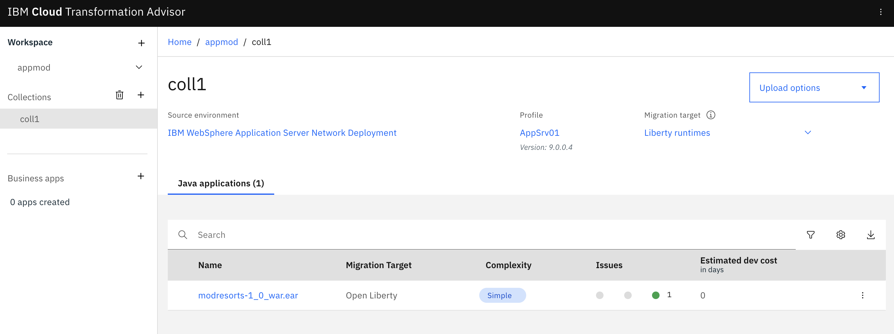
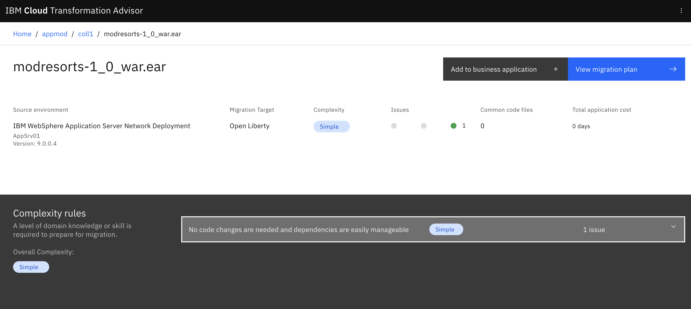

# Transform your traditional on-premises app and deploy it as a containerized app on a public cloud

> **Modernize Apps using IBM Transformation Advisor on IBM Cloud Pak for Applications on the IBM managed OpenShift cluster**

In this code pattern, we will use Transformation Advisor on IBM Cloud Pak for Applications to evaluate an on-premises traditional WebSphere application. We'll use Transformation Advisor, download the generated migration bundle and use its recommendations to deploy that app in a Liberty container running on IBM Cloud Pak for Applications running on the IBM managed OpenShift. *A sample web app is provided to demonstrate migration from on-premises to the IBM Cloud Pak for Applications.*

When the reader has completed this code pattern, they will understand how to:

* Access IBM Cloud Pak for Applications on the IBM managed OpenShift cluster (CP4Apps)
* Use Transformation Advisor to create a custom Data Collector
* Run the custom Data Collector to analyze a traditional WebSphere application
* Review the Transformation Advisor reports to see migration complexity, cost, and recommendations
* Generate artifacts to containerize the application
* Move the modernized application to IBM Cloud Pak for Applications on IBM managed OpenShift Cluster using a generated migration bundle

## Flow


1. Developer accesses IBM Transformation Advisor on IBM Cloud Pak for Applications on the IBM managed OpenShift cluster.
2. Developer downloads a custom Data Collector from IBM Transformation Advisor
3. Developer runs the Data Collector on the traditional WebSphere Application Server host where application(to be migrated) is running
4. Data Collector analysis is uploaded (automatically or manually)
5. Developer reviews recommendations in Transformation Advisor and creates a migration bundle
6. Developer downloads migration bundle
7. Developer uses Docker to build an image and upload it to OpenShift Docker Registry
8. Developer creates an app using the pushed image and runs the containerized app

## Pre-requisites

* [IBM Cloud account](https://cloud.ibm.com/)
* [IBM managed OpenShift Cluster instance](https://cloud.ibm.com/kubernetes/catalog/create?platformType=openshift)
* [OpenShift CLI](https://cloud.ibm.com/docs/openshift?topic=openshift-openshift-cli)
* [Docker](https://www.docker.com/)

## Steps

1. [Install IBM Cloud Pak for Applications](#1-install-ibm-cloud-pak-for-applications)
2. [Launch Transformation Advisor](#2-launch-transformation-advisor)
3. [Run the Data Collector](#3-run-the-data-collector)
4. [Upload results](#4-upload-results)
5. [View recommendations](#5-view-recommendations)
6. [Complete the migration bundle](#6-complete-the-migration-bundle)
7. [Test the application locally](7-test-the-application-locally)
8. [Deploy the application to OpenShift](#8-deploy-your-application-on-icp4a)

## 1. Install IBM Cloud Pak for Applications

Please refer to the [YouTube video](https://www.youtube.com/watch?v=gBI0ApHUFSs) below to install [IBM Cloud Pak for Applications](https://cloud.ibm.com/catalog/content/ibm-cp-applications-b4fbe4b9-a9de-406a-94de-5e0c7dc20bf7-global) on an IBM managed Red Hat OpenShift cluster.

[](https://www.youtube.com/watch?v=gBI0ApHUFSs)

Refer to the [IBM Cloud Pak for Applications Documentation](https://www.ibm.com/support/knowledgecenter/SSCSJL_4.1.x/install-icpa-cli.html) for instructions on how to install "IBM Cloud Pak for Applications" on a non-managed Red Hat OpenShift cluster.

## 2. Launch Transformation Advisor

As part of IBM Cloud Pak for Applications, Transformation Advisor is a tool that helps businesses modernize and migrate their applications from on-premises environments to the cloud. Refer to the [Transformation Advisor Documentation](https://www.ibm.com/support/knowledgecenter/SS5Q6W/welcome.html) to learn more about it. To launch Transformation Advisor perform the following steps:

The from navigation bar of the OpenShift console Open click on the `Cloud Pak Console` option.


Choose to launch `Transformation Advisor`


On the welcome screen, click the `+` to add a workspace.


Create a new workspace that will be used to house your recommendations. The workspace name can be any string you want, such as the project name or the name for the portfolio of applications you will be analysing.


You will then be asked to enter a collection name. This is an opportunity for you to subdivide your work even further into a more focused grouping. It would typically be associated with a single run of the Data Collector and may be the name of the individual WAS server that you will be running the Data Collector on.


## 3. Run the Data Collector

> **NOTE**: If you do not wish to run the Data Collector on your own WebSphere environment you can use the sample files we saved in [data/examples](data/examples) folder. Skip to the [Next section: "Upload results"](#4-upload-results) to continue.

The Data Collector identifies which profiles are associated with the WebSphere installation along with the installed WebSphere and Java versions. It also identifies all WebSphere applications within each deployment manager and standalone profile. The tool generates one folder per profile and places analysis results within that directory.

> **NOTE**: The Data Collector is compatiable with WebSphere Application Server 7.x or later.

### 3.1 Download the Data Collector

From your Transformation Advisor's project you will see an option to download the Data Collector. Click on `Data Collector` to start downloaing the zip file. Choose a version that is compatible with your target server’s operating system.


### 3.2 Move and unzip the Data Collector

> **WARNING:** The Data Collector is likely to consume a significant amount of resources while gathering data. Therefore, we recommend you run the tool in a pre-production environment. Depending on the number, size and complexity of your applications the Data Collector may take quite some time to execute and upload results.

Once the Data Collector is downloaded locally, move the zip file from your local machine to your target server. You can do this in many ways, below is just one suggestion.

```bash
sftp user@hostname <<< $'put transformationadvisor-2.1_Linux_example.tgz'
```

Unzip the file. Ensure the unzipped file is in a directory where you have read, write, and execute access.

```bash
tar xvfz transformationadvisor-2.1_Linux_example.tgz
```

Finally, go to the Data Collector directory.

```bash
cd transformationadvisor-2.1
```

### 3.3 Run the Data Collector

To start the analysis of applications (.jar, .ear, and .war files) on a specific WebSphere Application Server instance run the `transformationadvisor` command. For example:

```bash
./bin/transformationadvisor -w /opt/IBM/WebSphere/AppServer -p AppSrv01
```

## 4. Upload results

If there is a connection between your WebSphere system and the Transformation Advisor then the results will be uploaded automatically. Proceed to the [Next section: "View recommendations"](#5-view-recommendations).

If there is no connection, the Data Collector will return a .zip file containing your application data. Use the `Upload data` option to upload the .zip file(s).

* Find the results for each profile. These are zip file(s) created by the Data Collector with the same name as the profile. You will find the zip file(s) in the transformationadvisor directory of the Data Collector.

* Copy the zip file(s) to your local system and select them using the `Drop or Add File` button.

* Use the `Upload` button to upload the files.

## 5. View recommendations

Once the Data Collector has uploaded its results you will be able to view the analysis in the Transformation Advisor project's console. *Note that the cost estimates displayed by the tool are high-level estimates and may vary widely based on skills and other factors not considered by the tool.*

> **TIP**: You can use the `Advanced Settings` "gear" icon to change the `Dev cost multiplier` and `Overhead cost` and adjust the estimates for your team.



The recommendations tab shows you a table with a summary row for each application found on your application server. Each row contains the following information:

| Column | Description |
| ------ | ----------- |
| | *A drop-down arrow lets you expand the summary row to see the analysis for other targets.* |
| | *Alert icons may appear to indicate apps that are incompatible with a target.* |
| Application | *The name of the EAR/WAR file found on the application server.* |
| | *An indicator to show how complex Transformation Advisor considers this application to be if you were to migrate it to the cloud.* |
| Tech match | *This is a percentage and if less than 100% it indicates that there may be some technologies that are not suitable for the recommended platform. You should investigate the details and ensure your application is actually using the technologies.* |
| Dependencies | *This shows potential external dependencies detected during the scan. Work may be needed to configure access to these external dependencies.* |
| Issues | *This indicates the number and severity of potential issues migrating the application.* |
| Est. dev cost | *This is an estimate in days of the development effort to perform the migration.* |
| Total effort | *This is the total estimate in days of the overhead and development costs in migration up to the point of functional testing.* |
| | *The `Migration plan` button will take you to the Migration page for the application.* |

Each column in the table is sortable. There is also a `Search items` box which allows you to filter out rows of data. You can use the `+` symbol to see only rows that match all your terms (e.g., `Liberty+Simple`). You can filter by complexity using the filter button.

Clicking on your application name will take you to more information about the discovered `Complexity` and `Application Details`. For starters, the complexity rating is explained for you.



You will also see details for each issue and dependency discovered:


There will be additional sections to show any technology issues, external dependencies, and additional information related to your application transformation.

Scroll to the end of the recommendations screen to find three links to further detailed reports.


The three reports are described as follows:

### Analysis Report

The binary scanner’s detailed migration report digs deeper to understand the nitty-gritty details of the migration. The detailed report helps with migration issues like deprecated or removed APIs, Java SE version differences, and Java EE behavior differences. Please note that the Transformation Advisor uses a rule system based on common occurring events seen in real applications to enhance the base reports and to provide practical guidance. As a result of this some items may show a different severity level in Transformation Advisor than they do in the detailed binary scanner reports.


### Technology Report

The binary scanner can examine your application and generate the Application Evaluation Report, which shows which editions of WebSphere Application Server are best suited to run the application. The report provides a list of Java EE programming models that are used by the application, and it indicates on which platforms the application can be supported.


### Inventory Report

The binary scanner has an inventory report that helps you examine what’s in your application including the number of modules and the technologies in those modules. It also gives you a view of all the utility JAR files in the application that tend to accumulate over time. Potential deployment problems and performance considerations are also included.


## 6. Complete the migration bundle

In this step we will use Transformation Advisor to generate a migration bundle that includes code to build and deploy our application. From the Transformation Advisor console click on the context menu for the application you want to migrate and choose the `View migration plan` option.


### 6.1 Create the bundle

In the `Migration bundle` screen choose the following options:

* **Build type**: Choose the **Binary** option
* **Use the Accelerator for Teams Collection**: Choose **Don't use**
* **Application dependencies**: Choose **Manual upload**
* **Uploaded files**: Upload [`mod-resorts.jar`](data/examples/modresorts-1.0.war)
* Choose to **Download** the bundle locally.


Transformation Advisor will automatically create several artifacts needed to get your application running in a Liberty container on an OpenShift cluster. This includes a `Dockerfile`, a Liberty `server.xml` configuration file, and other Kubernetes CRDs.

### 6.2 Modifying the migration bundle

Once the bundle is unzipped it should have the following structure:

```ini
.
├── Dockerfile
├── operator
│   ├── application
│   │   ├── application-cr.yaml
│   │   └── application-crd.yaml
│   └── deploy
│       ├── operator.yaml
│       ├── role.yaml
│       ├── role_binding.yaml
│       └── service_account.yaml
├── pom.xml
└── src
    └── main
        ├── liberty
        │   ├── config
        │   │   └── server.xml
        │   └── lib
        └── webapp
            ├── WEB-INF
            │   └── web.xml
            └── index.html
```

> **IMPORTANT**: Navigate to `src/main/liberty/config` and update the `server.xml` file by commenting out the `webApplication` element by using the `<!--` and `-->` convention.

**Optionally**, you can create a new repo to save this code. If you're using [GitHub](https://github.com) then run the below commands to push the source files up.

```bash
git add -A
git commit -m "Add source code files"
git push
```

*For an example repo, check out <https://github.com/stevemar/migrated-mod-resorts>.*

## 7. Test the application locally

Before pushing our application to OpenShift we can build and run it locally. To build it use `docker build`.

```bash
docker build -t migrated-mod-resorts:v1 .
```

And to run it locally, use `docker run`.

```bash
docker run -p 9080:9080 migrated-mod-resorts:v1
```

Opening a browser to `localhost:9080/resorts` should show the application running.

**Optionally**, create a new repository on an image registry, like [DockerHub](https://hub.docker.com/), and run the command below to push your image.

```bash
docker build -t <YOUR_DOCKERHUB_USERNAME>/migrated-mod-resorts:v1 .
docker push <YOUR_DOCKERHUB_USERNAME>/migrated-mod-resorts:v1
```

*For an example image, check out <https://hub.docker.com/r/stevemar/migrated-mod-resorts>.*

## 8. Deploy the application to OpenShift

The final part of our journey is to deploy the application to Red Hat OpenShift.

### 8.1 Access the OpenShift Cluster using the `oc` CLI

To find your OpenShift cluster go to the [Kubernetes Cluster List](https://cloud.ibm.com/kubernetes/clusters) or from the IBM Cloud console go to `Clusters` > `Your OpenShift Cluster` > `OpenShift web console` as shown.


From the OpenShift web console click the menu in the upper right corner (the label contains your email address), and select `Copy Login Command`. Click on `Display token` and paste the command into a terminal session. For example:

```bash
oc login --token=xxxx --server=https://xxxx.containers.cloud.ibm.com:xxx
```

Next create a new project to run your application

```bash
oc new-project migrated-mod-resorts
```

### 8.2 Deploy the new bundle

Run the `oc new-app` command to deploy an application. Applications can be deployed by referencing a git repository or image registry. The command below find the containerized application on a public DockerHub account.

```bash
$ oc new-app stevemar/migrated-mod-resorts:v1
# oc new-app <YOUR_DOCKERHUB_USERNAME>/migrated-mod-resorts:v1
# oc new-app <YOUR_GITHUB_REPO>
```

Run the commands to below to check the status of the deployment. When the `oc status` command returns a positive message then run the `oc expose` command to make the application publicly visible.

```bash
$ oc status ## to check the status of the previous command and wait till it says "deployment #1 deployed..."

$ oc expose svc/migrated-mod-resorts  ## this command exposes service after creating app

# Verify the pods and services
$ oc get pods       ## it will show a pod running with modapp-openshift-** name
$ oc get services   ## it will show a service running with modapp-openshift name
```

### 8.3 Access the migrated app

To get the URL of the migrated application run the `oc get routes` command.

```bash
oc get routes
```

Open a browser, copy and paste the URL, and add a `/resorts` to the end of the path to view the migrated application.


## Learn More

* [Cloud Enabled Use Case: App Modernization Journey Part 2 - Replatform](https://www.ibm.com/cloud/garage/dte/tutorial/move-prem-websphere-app-cloud-transformation-advisor)
* [Build a secure microservices based banking application](https://developer.ibm.com/patterns/build-a-secure-microservices-based-application-with-transactional-flows/)
* [Java EE Application Modernization with OpenShift](https://developer.ibm.com/patterns/jee-app-modernization-with-openshift/)
* [Learn more about IBM Cloud Pak for Application](https://developer.ibm.com/series/ibm-cloud-pak-for-applications-video-series/)
* [More about Transformation Advisor](https://www.ibm.com/support/knowledgecenter/SS5Q6W/welcome.html)

## License

This code pattern is licensed under the Apache Software License, Version 2. Separate third-party code objects invoked within this code pattern are licensed by their respective providers pursuant to their own separate licenses. Contributions are subject to the [Developer Certificate of Origin, Version 1.1 (DCO)](https://developercertificate.org/) and the [Apache Software License, Version 2](https://www.apache.org/licenses/LICENSE-2.0.txt).

[Apache Software License (ASL) FAQ](https://www.apache.org/foundation/license-faq.html#WhatDoesItMEAN)
